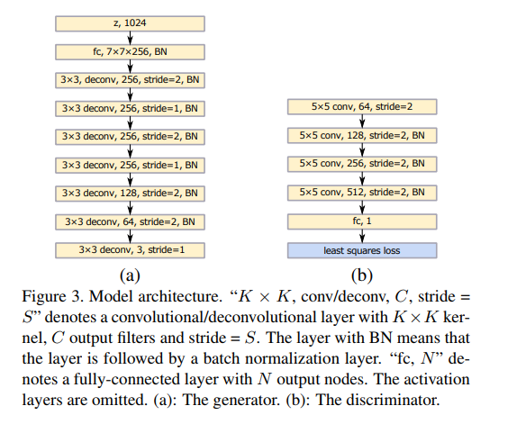
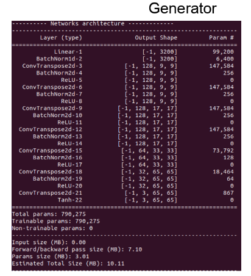
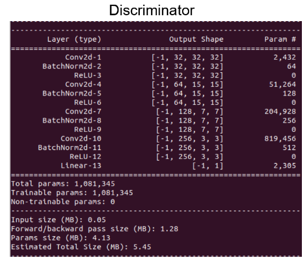
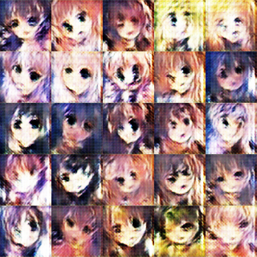
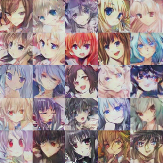

# LSGAN
LSGAN for image generation on anime dataset

## Reference Paper
[Least Squares Generative Adversarial Networks](https://ieeexplore.ieee.org/document/8237566) 

X. Mao, Q. Li, H. Xie, R. Y. K. Lau, Z. Wang and S. P. Smolley, "Least Squares Generative Adversarial Networks," 2017 IEEE International Conference on Computer Vision (ICCV), Venice, 2017, pp. 2813-2821.
doi: 10.1109/ICCV.2017.304

## Network Architecture
Basically follow the architecture in the reference paper. 

 

## Experiment Result
<b>At Epoch 10:</b> 
 

<b>At Epoch 350:<b> 
 

<b>Training Process:</b> 

